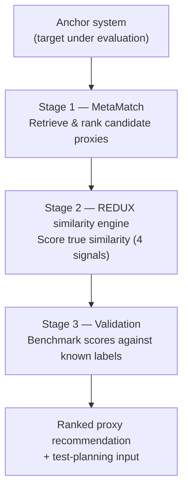

# Proxy Discovery for Critical AI Systems — Grant Summary

*High-level summary of work delivered under this grant. Full technical audit: [MASTER_EVALUATION.md](MASTER_EVALUATION.md).*

---

## Executive summary

Many high-consequence AI systems — across healthcare, transportation, finance, defense, and public services — cannot be inspected directly because they sit behind confidentiality agreements, export controls, or operational secrecy. Testing them responsibly therefore depends on a **proxy**: a public, open-source project that behaves enough like the restricted system to stand in for it during evaluation.

This project replaces the common practice of selecting a proxy by intuition with a measurable, repeatable method. We deliver an automated pipeline that (1) retrieves and ranks candidate proxies for a given system, (2) scores their true similarity across four independent signals, and (3) validates those scores against a labeled set of known matches and non-matches. The system is operational end to end, and on the validation set it cleanly separates genuine matches from non-matches.

---

## Headline numbers

*Verified metrics — suitable for slides and outreach. Full sources in [MASTER_EVALUATION.md](MASTER_EVALUATION.md).*

| | | |
| --- | --- | --- |
| **11** | CAIS domains covered | autonomous driving, medical AI, robotics, financial risk, cybersecurity, and others |
| **20** | anchor systems evaluated | all 20 produced fully qualified proxy shortlists (20/0/0 Good/OK/Weak) |
| **0** | non-discriminating results | down from 30 at baseline after systematic retrieval tuning |
| **216** | anchor–proxy similarity scores | 100 (queryv2) + 116 (anchorsv2 stability run) |
| **4** | independent similarity signals | metadata, code structure, dynamic behavior, cross-language |
| **F1 = 1.0** | classification on known matches | perfect separation on 3 of 4 signals (strict labeled test) |
| **94% vs 5%** | similar vs unrelated systems | ~90-point score gap between true matches and hard negatives |
| **96%** | result stability | top-5 overlap when the anchor list is perturbed (17/20 identical) |
| **24** | retrieval configurations tested | grid search frozen to a single validated winner |
| **IEEE 2026** | peer-reviewed publication | methodology operationalized as a running system |

**Retrieval improvement.** Systematic grid search across 24 configurations reduced non-discriminating results from **30 → 0** — the final winner is frozen and validated, not a one-off run.

---

## Deliverables

Concrete outputs delivered under this grant:

- **End-to-end pipeline** — MetaMatch retrieval, REDUX 4 similarity scoring, and labeled validation, operational as a single workflow.
- **Frozen experiment archive** — 24-configuration grid search with a validated winner (`penalty300_min700_cap22_queryv2`), committed under `runs/experiments/`.
- **Validation package** — labeled benchmark, scored pairs, discrimination statistics, and run manifests under `results_benchmark/`.
- **Peer-reviewed publication** — methodology published in *IEEE Computer* (2026); this repository is the executable implementation.
- **Open research codebase** — [github.com/mdk5293/Proxy-systems-for-Critical-AI-systems](https://github.com/mdk5293/Proxy-systems-for-Critical-AI-systems) with runnable tooling, configs, and frozen outputs.

---

## Background

A **Critical AI System (CAIS)** is a system where failure carries serious consequences. Responsible testing usually requires studying the system's internals, yet the system itself is often unavailable.

Selecting an open-source project that merely "looks similar" — by popularity, topic tags, or surface impression — does not establish that it shares the behaviors and risks under evaluation, and it does not withstand safety review. This work targets the precise question that matters: **whether a candidate proxy can be shown, with evidence, to be a defensible stand-in for a system that cannot be examined.**

---

## System architecture

The pipeline takes a starting system (an **anchor**) and processes it through three stages.

**Stage 1 — MetaMatch (retrieval).** Searches public repositories and returns a ranked shortlist of candidate proxies for the anchor. It is tuned to suppress non-discriminating results — for example, broadly popular projects that surface for almost any query without being genuinely relevant.

**Stage 2 — REDUX similarity engine (scoring).** Scores each candidate against the anchor on a 0–100 scale using four complementary signals, so that a strong match must hold up from multiple independent perspectives:

- **Development metadata and history** — how the project is built and maintained over time.
- **Code structure** — how the codebase is organized.
- **Dynamic behavior** — how the project operates.
- **Cross-language similarity** — likeness across different programming languages.

**Stage 3 — Validation.** The scores are benchmarked against a curated, labeled set: confirmed matches (such as official mirrors of the same project), confirmed non-matches, and harder borderline cases. This produces an honest measure of how well the engine distinguishes true matches from false ones.

---

## Results

All figures are drawn from the verified evaluation. See **Headline numbers** above for the outreach summary.

| Dimension | Result | Interpretation |
| --- | --- | --- |
| Retrieval quality | **20/20** anchors fully qualified, **0** junk results | Retrieval returns relevant candidates rather than noise. |
| Classification accuracy | **F1 = 1.0** on 3/4 signals (strict known-match test) | Every true match identified, every non-match rejected on the strict set. |
| Score separation | **94.4%** similar vs **4.7%** unrelated (~**90-pt** gap) | Wide, consistent margin between matches and non-matches. |
| Stability | **96%** top-5 overlap (**17/20** identical slugs) | Results are robust to the specific choice of inputs. |
| Scale | **216** scored pairs across **24** grid experiments | End-to-end pipeline exercised at non-trivial scale. |

**Worked example.** For `apache/airflow` (a widely used data-pipeline system), the pipeline ranked `feast` and `dagster` as top proxies at approximately **96/100**, then carried those recommendations forward into test-scenario planning — demonstrating the full path from retrieval through similarity scoring to test-relevant output.

| | Manual proxy selection | This system |
| --- | --- | --- |
| Basis | Intuition, popularity, surface resemblance | Measured similarity across four independent signals |
| Evidence | Informal assertion | Validated scores against labeled known matches |
| Reproducibility | Ad hoc, not repeatable | Frozen configs, committed outputs, documented pipeline |
| Review readiness | Unlikely to withstand safety review | Defensible, explainable scores with audit trail |

---

## Impact

Teams operating under source constraints can **justify proxy selection with measured evidence** instead of informal similarity claims — and carry ranked proxies forward into **test-scenario planning**.

**Who this serves:**

- **Safety and compliance reviewers** — need explainable evidence that a stand-in is appropriate, not a subjective pick.
- **CAIS engineering teams under NDA or export control** — cannot inspect the real system but must still argue test coverage.
- **Researchers and auditors** — need a repeatable method that works from public metadata alone.

---

## Significance

- **Defensible safety evidence.** Reviewers receive a measured, explainable similarity score backed by validation data rather than an assertion of resemblance.
- **Applicable under access constraints.** The method relies only on public signals, making it usable precisely where the underlying system cannot be shared.
- **Generalizable.** The same pipeline has been exercised across 11 high-stakes domains, including autonomous driving, medical AI, robotics, financial risk, and cybersecurity.
- **Grounded in published research.** The work operationalizes a peer-reviewed methodology (IEEE Computer, 2026) as a running, testable system.

---

## Dissemination and continuity

- **Publication** — peer-reviewed methodology in *IEEE Computer* (2026).
- **Open codebase** — maintained repository with frozen benchmarks, configs, and evaluation artifacts.
- **Figures and assets** — pipeline diagrams (`assets/figure2.png`, `assets/figure3.png`) align the implementation with the published paper.
- **Ongoing work** — roadmap below extends validation coverage and targets regulated industrial domains.

---

## Roadmap

- **Richer dynamic signals** — incorporate additional runtime and testing evidence where publicly available.
- **Unified multi-view score** — combine the four signals into a single score with an explicit confidence measure.
- **Expanded validation set** — grow the labeled benchmark to broaden the statistical basis of the accuracy figures.
- **Regulated and industrial domains** — extend the harness to restricted settings (defense, energy, transportation) where proxy testing is most needed.

---

## Presentation close

*Slide-ready summary for grant reporting.*

| | |
| --- | --- |
| **Delivered** | Pipeline · validation package · IEEE 2026 publication |
| **Proven** | 20/20 retrieval · F1 = 1.0 · 94% vs 5% separation |
| **Next** | Expanded validation · regulated domains · unified multi-view score |

---

*Prepared as a high-level overview for grant partners. Full methodology, verified sources, and detailed next steps are available in [MASTER_EVALUATION.md](MASTER_EVALUATION.md).*
